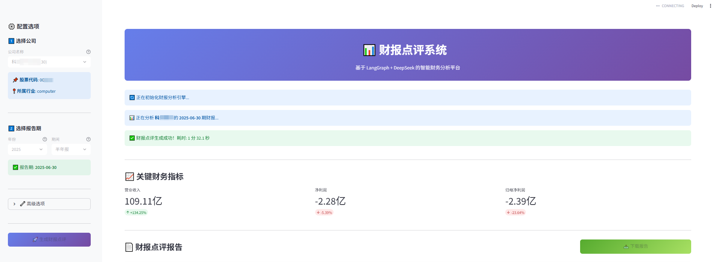
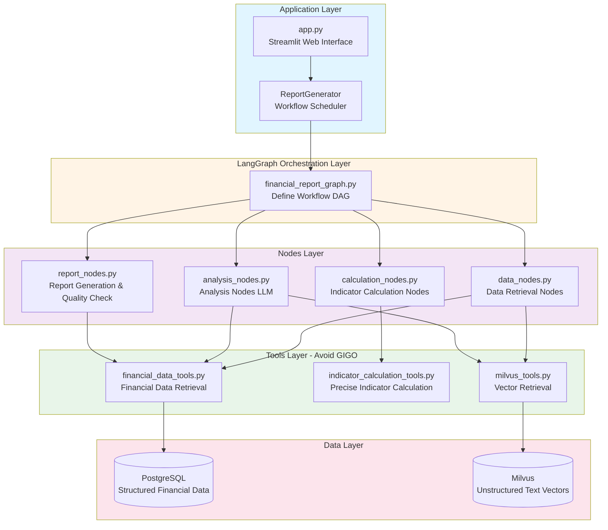

# Financial Report Review System

English | [简体中文](./README.md)

> An intelligent financial report analysis system based on LangChain + LangGraph + DeepSeek + PostgreSQL + Milvus



## 🎯 Core Philosophy

### Data and Logic Separation

1. **Structured Data Processing**: Retrieve financial statement data from PostgreSQL and use code logic to precisely calculate objective technical indicators
2. **Unstructured Data Processing**: Retrieve financial report text from Milvus vector database to provide business context and textual descriptions
3. **AI Intelligent Analysis**: Generate professional financial report reviews by combining structured indicators and unstructured context through LLM

### Design Principles

- ✅ **Avoid GIGO**: Calculate indicators that can be pre-computed using code logic with precision, avoiding LLM calculation errors
- ✅ **Workflow Orchestration**: Build visual workflows based on LangGraph with clear node and edge definitions
- ✅ **Separation of Concerns**: Tools execute tasks, Nodes handle logic, Graphs orchestrate flows, LLM generates insights
- ✅ **Industry Extensibility**: Define core, auxiliary, and personalized indicator systems based on industry configuration
- ✅ **Prompt Independence**: Centralized management of all prompts for easy maintenance and optimization
- ✅ **Data Source Extensibility**: Reserved interfaces to support announcements, research reports, and other data sources

## 📂 Project Structure

```
fin-report-reviewer/
├── src/
│   ├── config/                         # Configuration modules
│   │   ├── settings.py                # Environment config (database, LLM, Embedding, etc.)
│   │   ├── industry_configs.py        # Industry config (core/auxiliary/personalized indicators)
│   │   └── prompts.py                 # Prompt configuration (centralized management)
│   ├── database/                       # Database services
│   │   └── financial_data_service.py  # PostgreSQL financial data service
│   ├── retrieval/                      # Vector retrieval
│   │   └── vector_retriever.py        # Milvus retrieval service
│   ├── extractors/                     # Indicator extraction
│   │   └── indicator_extractor.py     # Technical indicator calculator (objective calculation)
│   ├── analysis/                       # Analysis generation
│   │   └── report_generator.py        # Report generator (coordinates LangGraph workflow)
│   ├── graphs/                         # LangGraph workflows
│   │   ├── financial_report_graph.py  # Workflow orchestration (DAG definition)
│   │   └── state.py                   # State management (TypedDict)
│   ├── nodes/                          # LangGraph nodes
│   │   ├── data_nodes.py              # Data retrieval nodes
│   │   ├── calculation_nodes.py       # Indicator calculation nodes
│   │   ├── analysis_nodes.py          # Analysis nodes (LLM calls)
│   │   └── report_nodes.py            # Report generation and quality check nodes
│   ├── tools/                          # LangChain Tools
│   │   ├── financial_data_tools.py    # Financial data retrieval tools
│   │   ├── indicator_calculation_tools.py # Indicator calculation tools
│   │   └── milvus_tools.py            # Milvus retrieval tools
│   ├── ingestion/                      # Data ingestion
│   │   └── report_ingestion_service.py # PDF ingestion to Milvus (single responsibility)
│   └── parsers/                        # Data parsing
│       └── financial_pdf_parser.py    # PDF text parser
├── scripts/
│   ├── database_schema.sql            # Database table structure (Wind format)
│   └── import_financial_data.py       # Financial data import script
├── docs/
│   ├── 需求文档.md                    # Business requirements and industry characteristics
│   ├── 系统架构设计.md                # Detailed system architecture design
│   └── LangGraph架构说明.md           # LangGraph workflow architecture explanation
├── data/
│   ├── pdfs/                          # PDF financial report files
│   ├── excel_reports/                 # Excel format financial data
│   ├── reports/                       # Generated reports
│   └── uploads/                       # Uploaded files
├── app.py                             # Streamlit Web interface
├── test_report_generation.py          # Complete functionality test
├── test_milvus_query.py              # Milvus query test
├── test_report_ingestion.py          # PDF ingestion test
├── requirements.txt                   # Python dependencies
└── env.example                        # Environment variable example
```

## 🚀 Quick Start

### 1. Environment Setup

```bash
# Clone the project
git clone <repository_url>
cd fin-report-reviewer

# Install dependencies
pip install -r requirements.txt

# Configure environment variables
cp env.example .env
# Edit the .env file and configure the following required items:
# - DEEPSEEK_API_KEY: DeepSeek API key
# - DATABASE_URL: PostgreSQL connection string
# - MILVUS_HOST/USER/PASSWORD: Milvus connection information
# - EMBEDDING_MODEL: Embedding model path (default: BAAI/bge-large-zh-v1.5)
```

### 2. Data Preparation

#### 2.1 Create Database Tables

```bash
# Create PostgreSQL table structure using scripts/database_schema.sql
psql -U postgres -d financial_reports -f scripts/database_schema.sql
```

#### 2.2 Import Financial Report Data

**Option 1: Import from Excel (Recommended)**

```bash
# Place Wind-exported Excel files in the data/excel_reports/ directory
# Directory structure:
# data/excel_reports/
#   ├── 利润表/FS_Comins.xlsx
#   ├── 资产负债表/FS_Combas.xlsx
#   └── 现金流量表(直接法)/FS_Comscfd.xlsx

# Configure .env file
DATA_SOURCE=excel
EXCEL_DATA_DIR=./data/excel_reports
```

**Option 2: Import from PostgreSQL**

```bash
# Use import script
python scripts/import_financial_data.py

# Configure .env file
DATA_SOURCE=database
```

#### 2.3 Ingest PDFs to Milvus (Optional)

```bash
# Ingest a single PDF file
python -m src.ingestion.report_ingestion_service \
  --file data/pdfs/360-2024Q1.pdf \
  --company "360 Security" \
  --code "601360" \
  --period "2024-03-31"
```

### 3. Start the Application

#### Option 1: Web Interface (Recommended)

```bash
# Launch Streamlit Web interface
streamlit run app.py

# Open browser at http://localhost:8501
# Select company and reporting period in the interface, click "Generate Financial Report Review"
```

#### Option 2: Command Line

```python
from src.analysis.report_generator import ReportGenerator

# Create generator
generator = ReportGenerator()

# Generate report
result = generator.generate_report(
    company_name="360 Security",
    company_code="601360",
    report_period="2024-03-31",
    industry="computer"
)

# View results
print(result["report"])
```

### 4. Test Features

```bash
# Test complete report generation process
python test_report_generation.py

# Test Milvus vector retrieval
python test_milvus_query.py

# Test PDF ingestion
python test_report_ingestion.py
```

## 🏗️ System Architecture

### LangGraph Workflow Architecture

The system is built on **LangGraph** with a three-layer architecture: **Tools → Nodes → Graphs**:

#### Overall Architecture Layers



#### Workflow Execution Flow

```mermaid
flowchart LR
    START([Start]) --> FETCH[Fetch Financial Data<br/>fetch_financial_data]
    FETCH --> CALC[Calculate Technical Indicators<br/>calculate_indicators]
    CALC --> RETRIEVE[Retrieve Text Context<br/>retrieve_context]
    RETRIEVE --> CORE[Analyze Core Indicators<br/>analyze_core]
    CORE --> AUX[Analyze Auxiliary Indicators<br/>analyze_auxiliary]
    AUX --> SPEC[Analyze Personalized Indicators<br/>analyze_specific]
    SPEC --> GEN[Generate Financial Report<br/>generate_report]
    GEN --> QC[Quality Check<br/>quality_check]
    QC -->|quality >= 80| END([End])
    QC -->|quality < 80| GEN
  
    style START fill:#4caf50,color:#fff
    style END fill:#f44336,color:#fff
    style FETCH fill:#2196f3,color:#fff
    style CALC fill:#2196f3,color:#fff
    style RETRIEVE fill:#2196f3,color:#fff
    style CORE fill:#ff9800,color:#fff
    style AUX fill:#ff9800,color:#fff
    style SPEC fill:#ff9800,color:#fff
    style GEN fill:#9c27b0,color:#fff
    style QC fill:#607d8b,color:#fff
```



### Core Design Philosophy

1. **Separation of Concerns**

   - **Tools**: Execute specific tasks (data retrieval, indicator calculation), return precise results
   - **Nodes**: Business logic processing, coordinate Tools and LLM
   - **Graphs**: Workflow orchestration, define node execution order and conditional routing
   - **LLM**: Analysis and insight generation, no numerical calculations
2. **Avoid GIGO (Garbage In Garbage Out)**

   - All numerical calculations are precisely completed by Python code
   - LLM only receives calculated indicators for analysis
   - Example: Revenue growth rate, gross margin, etc. are calculated by `indicator_calculation_tools`
3. **State Management**

   - Use `FinancialReportState` (TypedDict) to pass data between nodes
   - Includes: input information, financial data, indicators, analysis results, metadata, etc.

For detailed architecture explanation, please refer to: [LangGraph Architecture Documentation](docs/LangGraph架构说明.md)

## 📊 Supported Industries

Currently supported:

- **Computer Industry** (`computer`)
  - Core indicators: Revenue growth rate, net profit growth rate, net profit attributable to parent company growth rate
  - Auxiliary indicators: Gross margin, R&D expense ratio, sales expense ratio, administrative expense ratio
  - Personalized indicators: Contract liabilities (subscription companies), inventory (hardware companies)

Extending new industries:

1. Define `IndustryConfig` in `src/config/industry_configs.py`
2. Configure core, auxiliary, and personalized indicators (`IndicatorConfig`)
3. (Optional) Add industry-specific prompts in `src/config/prompts.py`
4. Register with `IndustryConfigManager`

## 🔧 Configuration Guide

### Environment Variable Configuration

All configuration items are managed in the `.env` file, create by referencing `env.example`:

```bash
cp env.example .env
```

**Core Configuration Items**:

| Configuration Item | Description                  | Default Value          |
| ------------------ | ---------------------------- | ---------------------- |
| `DEEPSEEK_API_KEY` | DeepSeek API key             | Required               |
| `DATABASE_URL`     | PostgreSQL connection string | Required               |
| `MILVUS_HOST`      | Milvus server address        | localhost              |
| `MILVUS_USER`      | Milvus username              | Required               |
| `MILVUS_PASSWORD`  | Milvus password              | Required               |
| `EMBEDDING_MODEL`  | Embedding model path         | BAAI/bge-large-zh-v1.5 |
| `EMBEDDING_DIM`    | Embedding dimension          | 1024                   |
| `DATA_SOURCE`      | Data source type             | excel                  |

For complete configuration, please refer to `env.example`.

### Industry Configuration Example

Configuration file location: `src/config/industry_configs.py`

```python
COMPUTER_INDUSTRY_CONFIG = IndustryConfig(
    code="computer",
    name="Computer",
    description="Software & Services, Hardware, Semiconductors, etc.",
    characteristics=[
        "Growth-oriented, high-risk preference industry",
        "High valuation characteristics (high PE multiples)",
        "Unpredictable performance, strong adjustment capability"
    ],
    indicators=[
        IndicatorConfig(
            name="revenue_growth",
            display_name="Revenue Growth Rate",
            priority=IndicatorPriority.CORE,
            calculation_method="(Current Revenue - Previous Revenue) / Previous Revenue",
            interpretation="Revenue growth rate is the most core indicator for growth stocks"
        ),
        # ... more indicators
    ]
)
```

## 🛠️ Development Guide

### Adding New Calculation Indicators

**Step 1: Define Tool** (`src/tools/indicator_calculation_tools.py`)

```python
@tool
def calculate_xxx_indicator_tool(
    param1: float,
    param2: float
) -> Dict[str, Any]:
    """Calculate XXX indicator"""
    result = param1 / param2  # Precise calculation
    return {
        "value": result,
        "display_format": f"{result:.2%}"
    }
```

**Step 2: Call in Node** (`src/nodes/calculation_nodes.py`)

```python
# Call new Tool in calculate_indicators_node
xxx_result = calculate_xxx_indicator_tool.invoke({
    "param1": data1,
    "param2": data2
})
state["xxx_indicator"] = xxx_result
```

**Step 3: Configure Industry Indicator** (`src/config/industry_configs.py`)

```python
IndicatorConfig(
    name="xxx_indicator",
    display_name="XXX Indicator",
    priority=IndicatorPriority.CORE,
    calculation_method="Formula description",
    interpretation="Indicator meaning"
)
```

### Adding New Workflow Nodes

**Step 1: Define Node Function** (`src/nodes/xxx_nodes.py`)

```python
def xxx_node(state: FinancialReportState) -> FinancialReportState:
    """New node: Execute XXX task"""
    logger.info("Executing XXX node")
  
    # Call Tool or LLM
    result = some_tool.invoke({...})
  
    # Update state
    state["xxx_result"] = result
    return state
```

**Step 2: Register to Workflow** (`src/graphs/financial_report_graph.py`)

```python
# Add node
workflow.add_node("xxx_node", xxx_node)

# Define connections
workflow.add_edge("previous_node", "xxx_node")
workflow.add_edge("xxx_node", "next_node")
```

### Extending Data Sources

**Step 1: Create Data Service** (`src/database/xxx_data_service.py`)

```python
class XXXDataService:
    """New data source service"""
  
    def get_xxx_data(self, company_code: str, period: str):
        # Data retrieval logic
        return data
```

**Step 2: Wrap as Tool** (`src/tools/xxx_tools.py`)

```python
@tool
def get_xxx_data_tool(company_code: str, period: str) -> Dict[str, Any]:
    """Get XXX data"""
    service = XXXDataService()
    return service.get_xxx_data(company_code, period)
```

**Step 3: Use in Node**

```python
def fetch_xxx_data_node(state: FinancialReportState):
    data = get_xxx_data_tool.invoke({...})
    state["xxx_data"] = data
    return state
```

## 📝 Tech Stack

- **Programming Language**: Python 3.10+
- **AI Framework**: LangChain 0.3+, LangGraph 0.2+
- **LLM Provider**: DeepSeek (OpenAI-compatible interface)
- **Vector Database**: Milvus 2.4+
- **Relational Database**: PostgreSQL 16+
- **Embedding Model**: Sentence-Transformers (BAAI BGE series)
- **PDF Parsing**: pdfplumber, pymupdf
- **Web Framework**: Streamlit, FastAPI
- **Configuration Management**: Pydantic Settings
- **Logging**: Loguru

## 📚 Related Documentation

- [Requirements Document](docs/需求文档.md) - Business requirements and industry characteristics analysis
- [System Architecture Design](docs/系统架构设计.md) - Detailed architecture design document
- [LangGraph Architecture Explanation](docs/LangGraph架构说明.md) - LangGraph workflow detailed explanation
- [Database Field Mapping](docs/database_field_mapping.md) - Wind database field description

## 🎯 Use Cases

### Case 1: Batch Generate Quarterly Report Reviews

```python
from src.analysis.report_generator import ReportGenerator

generator = ReportGenerator()

companies = [
    ("360 Security", "601360"),
    ("Hikvision", "002415"),
    ("iFlytek", "002230")
]

for name, code in companies:
    result = generator.generate_report(
        company_name=name,
        company_code=code,
        report_period="2024-06-30",
        industry="computer"
    )
  
    # Save report
    with open(f"data/reports/{name}_2024Q2.md", "w") as f:
        f.write(result["report"])
```

### Case 2: Web Interface Interactive Analysis

```bash
# Launch Streamlit interface
streamlit run app.py

# Features:
# - Visual operation interface
# - Real-time report generation
# - Support report download
# - Display key financial indicators
```

## ⚠️ Important Notes

1. **Data Preparation**

   - Ensure PostgreSQL has complete financial report data (income statement, balance sheet, cash flow statement)
   - Optional: Ingest PDF financial reports into Milvus for richer analysis context
2. **API Configuration**

   - DeepSeek API requires a valid key and sufficient quota
   - Recommended to configure `DEEPSEEK_TEMPERATURE=0.1` for stable output
3. **Embedding Model**

   - First run will automatically download the model (about 1.3GB for bge-large-zh)
   - Can configure `EMBEDDING_CACHE_DIR` to specify model cache location
   - GPU acceleration: Set `EMBEDDING_DEVICE=cuda`
4. **Performance Optimization**

   - Using `DATA_SOURCE=excel` to read data from local Excel is faster
   - Milvus index type is HNSW, fast retrieval speed
   - LLM calls use step-by-step strategy to avoid single Token being too long

## 🤝 Contribution Guide

Welcome to submit Issues and Pull Requests!

**Contribution Directions**:

- Add new industry configurations (pharmaceuticals, consumer, finance, etc.)
- Optimize Prompt templates to improve report quality
- Add more financial indicator calculations
- Improve Web interface interaction experience
- Performance optimization and bug fixes

## 📄 License

MIT License

## 📞 Contact

If you have any questions, please submit an Issue or contact the development team.

---

**Disclaimer**: The financial report reviews generated by this system are for reference only and do not constitute investment advice. Investment carries risks, and decisions should be made with caution.

