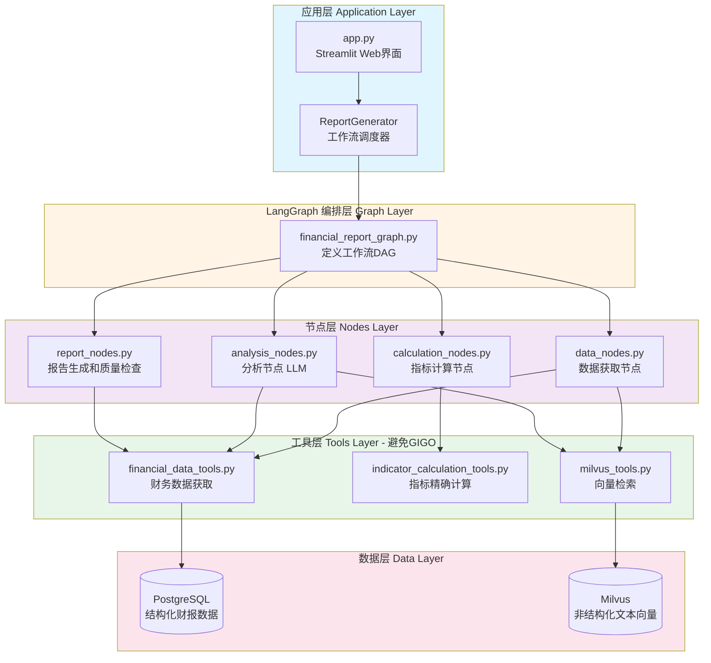

# 财报点评系统

[English](./README-EN.md) | 简体中文

> 基于 LangChain + LangGraph + DeepSeek + PostgreSQL + Milvus 的智能财报分析系统


## 🎯 核心理念

### 数据与逻辑分离

1. **结构化数据处理**：从PostgreSQL获取财报三表数据，使用代码逻辑精确计算客观技术指标
2. **非结构化数据处理**：从Milvus向量库检索财报文本，提供业务上下文和文字说明
3. **AI智能分析**：结合结构化指标和非结构化上下文，由LLM生成专业财报点评报告

### 设计原则

- ✅ **避免GIGO**：能够提前计算的指标使用代码逻辑精确计算，避免LLM计算导致的错误
- ✅ **工作流编排**：基于LangGraph构建可视化工作流，清晰的节点和边定义
- ✅ **职责分离**：Tools执行任务、Nodes处理逻辑、Graphs编排流程、LLM生成洞察
- ✅ **行业可扩展**：基于行业配置定义核心、辅助和个性化指标体系
- ✅ **提示词独立**：所有Prompt集中管理，便于维护和优化
- ✅ **数据源可扩展**：预留接口支持公告、研报等其他数据源

## 📂 项目结构

```
fin-report-reviewer/
├── src/
│   ├── config/                         # 配置模块
│   │   ├── settings.py                # 环境配置（数据库、LLM、Embedding等）
│   │   ├── industry_configs.py        # 行业配置（核心/辅助/个性化指标）
│   │   └── prompts.py                 # 提示词配置（集中管理所有Prompt）
│   ├── database/                       # 数据库服务
│   │   └── financial_data_service.py  # PostgreSQL财务数据服务
│   ├── retrieval/                      # 向量检索
│   │   └── vector_retriever.py        # Milvus检索服务
│   ├── extractors/                     # 指标提取
│   │   └── indicator_extractor.py     # 技术指标计算器（客观计算）
│   ├── analysis/                       # 分析生成
│   │   └── report_generator.py        # 报告生成器（协调LangGraph工作流）
│   ├── graphs/                         # LangGraph 工作流
│   │   ├── financial_report_graph.py  # 工作流编排（DAG定义）
│   │   └── state.py                   # 状态管理（TypedDict）
│   ├── nodes/                          # LangGraph 节点
│   │   ├── data_nodes.py              # 数据获取节点
│   │   ├── calculation_nodes.py       # 指标计算节点
│   │   ├── analysis_nodes.py          # 分析节点（LLM调用）
│   │   └── report_nodes.py            # 报告生成和质量检查节点
│   ├── tools/                          # LangChain Tools
│   │   ├── financial_data_tools.py    # 财务数据获取工具
│   │   ├── indicator_calculation_tools.py # 指标计算工具
│   │   └── milvus_tools.py            # Milvus检索工具
│   ├── ingestion/                      # 数据摄入
│   │   └── report_ingestion_service.py # PDF摄入Milvus（单一职责）
│   └── parsers/                        # 数据解析
│       └── financial_pdf_parser.py    # PDF文本解析器
├── scripts/
│   ├── database_schema.sql            # 数据库表结构（Wind格式）
│   └── import_financial_data.py       # 财报数据导入脚本
├── docs/
│   ├── 需求文档.md                    # 业务需求与行业特征
│   ├── 系统架构设计.md                # 系统架构详细设计
│   └── LangGraph架构说明.md           # LangGraph工作流架构说明
├── data/
│   ├── pdfs/                          # PDF财报文件
│   ├── excel_reports/                 # Excel格式财报数据
│   ├── reports/                       # 生成的报告
│   └── uploads/                       # 上传的文件
├── app.py                             # Streamlit Web 界面
├── test_report_generation.py          # 完整功能测试
├── test_milvus_query.py              # Milvus查询测试
├── test_report_ingestion.py          # PDF摄入测试
├── requirements.txt                   # Python依赖
└── env.example                        # 环境变量示例
```

## 🚀 快速开始

### 1. 环境准备

```bash
# 克隆项目
git clone <repository_url>
cd fin-report-reviewer

# 安装依赖
pip install -r requirements.txt

# 配置环境变量
cp env.example .env
# 编辑 .env 文件，配置以下必需项：
# - DEEPSEEK_API_KEY: DeepSeek API密钥
# - DATABASE_URL: PostgreSQL连接字符串
# - MILVUS_HOST/USER/PASSWORD: Milvus连接信息
# - EMBEDDING_MODEL: Embedding模型路径（默认BAAI/bge-large-zh-v1.5）
```

### 2. 数据准备

#### 2.1 创建数据库表

```bash
# 使用 scripts/database_schema.sql 创建PostgreSQL表结构
psql -U postgres -d financial_reports -f scripts/database_schema.sql
```

#### 2.2 导入财报数据

**方式一：从Excel导入（推荐）**

```bash
# 将Wind导出的Excel文件放入 data/excel_reports/ 目录
# 目录结构：
# data/excel_reports/
#   ├── 利润表/FS_Comins.xlsx
#   ├── 资产负债表/FS_Combas.xlsx
#   └── 现金流量表(直接法)/FS_Comscfd.xlsx

# 配置 .env 文件
DATA_SOURCE=excel
EXCEL_DATA_DIR=./data/excel_reports
```

**方式二：从PostgreSQL导入**

```bash
# 使用导入脚本
python scripts/import_financial_data.py

# 配置 .env 文件
DATA_SOURCE=database
```

#### 2.3 摄入PDF到Milvus（可选）

```bash
# 摄入单个PDF文件
python -m src.ingestion.report_ingestion_service \
  --file data/pdfs/360-2024Q1.pdf \
  --company "三六零" \
  --code "601360" \
  --period "2024-03-31"
```

### 3. 启动应用

#### 方式一：Web界面（推荐）

```bash
# 启动 Streamlit Web 界面
streamlit run app.py

# 浏览器打开 http://localhost:8501
# 在界面上选择公司、报告期，点击"生成财报点评"
```

#### 方式二：命令行

```python
from src.analysis.report_generator import ReportGenerator

# 创建生成器
generator = ReportGenerator()

# 生成报告
result = generator.generate_report(
    company_name="三六零",
    company_code="601360",
    report_period="2024-03-31",
    industry="computer"
)

# 查看结果
print(result["report"])
```

### 4. 测试功能

```bash
# 测试完整报告生成流程
python test_report_generation.py

# 测试Milvus向量检索
python test_milvus_query.py

# 测试PDF摄入
python test_report_ingestion.py
```

## 🏗️ 系统架构

### LangGraph 工作流架构

系统基于 **LangGraph** 构建，采用 **Tools → Nodes → Graphs** 的三层架构：

#### 整体架构层次



#### 工作流执行流程


### 核心设计理念

1. **职责分离**

   - **Tools**：执行具体任务（数据获取、指标计算），返回精确结果
   - **Nodes**：业务逻辑处理，协调Tools和LLM
   - **Graphs**：工作流编排，定义节点执行顺序和条件路由
   - **LLM**：分析和生成洞察，不做数值计算
2. **避免GIGO（Garbage In Garbage Out）**

   - 所有数值计算由 Python 代码精确完成
   - LLM 只接收计算好的指标进行分析
   - 示例：营业收入增速、毛利率等由 `indicator_calculation_tools` 计算
3. **状态管理**

   - 使用 `FinancialReportState` (TypedDict) 在节点间传递数据
   - 包含：输入信息、财务数据、指标、分析结果、元数据等

详细架构说明请参考：[LangGraph架构说明.md](docs/LangGraph架构说明.md)

## 📊 支持的行业

当前支持：

- **计算机行业** (`computer`)
  - 核心指标：营业收入增速、净利润增速、归母净利润增速
  - 辅助指标：毛利率、研发费用率、销售费用率、管理费用率
  - 个性化指标：合同负债（订阅制公司）、存货（硬件公司）

扩展新行业：

1. 在 `src/config/industry_configs.py` 中定义 `IndustryConfig`
2. 配置核心、辅助、个性化指标（`IndicatorConfig`）
3. （可选）在 `src/config/prompts.py` 中添加行业特定提示词
4. 注册到 `IndustryConfigManager`

## 🔧 配置说明

### 环境变量配置

所有配置项在 `.env` 文件中管理，参考 `env.example` 创建：

```bash
cp env.example .env
```

**核心配置项**：

| 配置项               | 说明                 | 默认值                 |
| -------------------- | -------------------- | ---------------------- |
| `DEEPSEEK_API_KEY` | DeepSeek API密钥     | 必需                   |
| `DATABASE_URL`     | PostgreSQL连接字符串 | 必需                   |
| `MILVUS_HOST`      | Milvus服务器地址     | localhost              |
| `MILVUS_USER`      | Milvus用户名         | 必需                   |
| `MILVUS_PASSWORD`  | Milvus密码           | 必需                   |
| `EMBEDDING_MODEL`  | Embedding模型路径    | BAAI/bge-large-zh-v1.5 |
| `EMBEDDING_DIM`    | Embedding维度        | 1024                   |
| `DATA_SOURCE`      | 数据源类型           | excel                  |

完整配置请参考 `env.example`。

### 行业配置示例

配置文件位置：`src/config/industry_configs.py`

```python
COMPUTER_INDUSTRY_CONFIG = IndustryConfig(
    code="computer",
    name="计算机",
    description="软件与服务、硬件、半导体等",
    characteristics=[
        "成长性导向，高风偏行业",
        "高估值特征（PE倍数高）",
        "业绩不可预测，调节能力强"
    ],
    indicators=[
        IndicatorConfig(
            name="revenue_growth",
            display_name="营业收入增速",
            priority=IndicatorPriority.CORE,
            calculation_method="(本期营收 - 上期营收) / 上期营收",
            interpretation="收入增速是成长股最核心的指标"
        ),
        # ... 更多指标
    ]
)
```

## 🛠️ 开发指南

### 添加新的计算指标

**步骤1：定义Tool** (`src/tools/indicator_calculation_tools.py`)

```python
@tool
def calculate_xxx_indicator_tool(
    param1: float,
    param2: float
) -> Dict[str, Any]:
    """计算XXX指标"""
    result = param1 / param2  # 精确计算
    return {
        "value": result,
        "display_format": f"{result:.2%}"
    }
```

**步骤2：在Node中调用** (`src/nodes/calculation_nodes.py`)

```python
# 在 calculate_indicators_node 中调用新Tool
xxx_result = calculate_xxx_indicator_tool.invoke({
    "param1": data1,
    "param2": data2
})
state["xxx_indicator"] = xxx_result
```

**步骤3：配置行业指标** (`src/config/industry_configs.py`)

```python
IndicatorConfig(
    name="xxx_indicator",
    display_name="XXX指标",
    priority=IndicatorPriority.CORE,
    calculation_method="公式说明",
    interpretation="指标含义"
)
```

### 添加新的工作流节点

**步骤1：定义Node函数** (`src/nodes/xxx_nodes.py`)

```python
def xxx_node(state: FinancialReportState) -> FinancialReportState:
    """新节点：执行XXX任务"""
    logger.info("执行XXX节点")
  
    # 调用Tool或LLM
    result = some_tool.invoke({...})
  
    # 更新状态
    state["xxx_result"] = result
    return state
```

**步骤2：注册到工作流** (`src/graphs/financial_report_graph.py`)

```python
# 添加节点
workflow.add_node("xxx_node", xxx_node)

# 定义连接
workflow.add_edge("previous_node", "xxx_node")
workflow.add_edge("xxx_node", "next_node")
```

### 扩展数据源

**步骤1：创建数据服务** (`src/database/xxx_data_service.py`)

```python
class XXXDataService:
    """新数据源服务"""
  
    def get_xxx_data(self, company_code: str, period: str):
        # 获取数据逻辑
        return data
```

**步骤2：封装为Tool** (`src/tools/xxx_tools.py`)

```python
@tool
def get_xxx_data_tool(company_code: str, period: str) -> Dict[str, Any]:
    """获取XXX数据"""
    service = XXXDataService()
    return service.get_xxx_data(company_code, period)
```

**步骤3：在Node中使用**

```python
def fetch_xxx_data_node(state: FinancialReportState):
    data = get_xxx_data_tool.invoke({...})
    state["xxx_data"] = data
    return state
```

## 📝 技术栈

- **编程语言**：Python 3.10+
- **AI框架**：LangChain 0.3+, LangGraph 0.2+
- **LLM提供商**：DeepSeek (OpenAI兼容接口)
- **向量数据库**：Milvus 2.4+
- **关系数据库**：PostgreSQL 16+
- **Embedding模型**：Sentence-Transformers (BAAI BGE系列)
- **PDF解析**：pdfplumber, pymupdf
- **Web框架**：Streamlit, FastAPI
- **配置管理**：Pydantic Settings
- **日志**：Loguru

## 📚 相关文档

- [需求文档](docs/需求文档.md) - 业务需求与行业特征分析
- [系统架构设计](docs/系统架构设计.md) - 详细的架构设计文档
- [LangGraph架构说明](docs/LangGraph架构说明.md) - LangGraph工作流详解
- [数据库字段映射](docs/database_field_mapping.md) - Wind数据库字段说明

## 🎯 使用场景

### 场景1：批量生成季报点评

```python
from src.analysis.report_generator import ReportGenerator

generator = ReportGenerator()

companies = [
    ("三六零", "601360"),
    ("海康威视", "002415"),
    ("科大讯飞", "002230")
]

for name, code in companies:
    result = generator.generate_report(
        company_name=name,
        company_code=code,
        report_period="2024-06-30",
        industry="computer"
    )
  
    # 保存报告
    with open(f"data/reports/{name}_2024Q2.md", "w") as f:
        f.write(result["report"])
```

### 场景2：Web界面交互分析

```bash
# 启动Streamlit界面
streamlit run app.py

# 特点：
# - 可视化操作界面
# - 实时生成报告
# - 支持报告下载
# - 显示关键财务指标
```

## ⚠️ 注意事项

1. **数据准备**

   - 确保PostgreSQL中有完整的财报数据（利润表、资产负债表、现金流量表）
   - 可选：将PDF财报摄入Milvus获得更丰富的分析上下文
2. **API配置**

   - DeepSeek API需要有效的密钥和足够的额度
   - 建议配置 `DEEPSEEK_TEMPERATURE=0.1` 以获得稳定输出
3. **Embedding模型**

   - 首次运行会自动下载模型（约1.3GB for bge-large-zh）
   - 可配置 `EMBEDDING_CACHE_DIR` 指定模型缓存位置
   - GPU加速：设置 `EMBEDDING_DEVICE=cuda`
4. **性能优化**

   - 使用 `DATA_SOURCE=excel` 从本地Excel读取数据更快
   - Milvus索引类型为HNSW，检索速度快
   - LLM调用采用分步策略，避免单次Token过长

## 🤝 贡献指南

欢迎提交Issue和Pull Request！

**贡献方向**：

- 新增行业配置（医药、消费、金融等）
- 优化Prompt模板提升报告质量
- 添加更多财务指标计算
- 改进Web界面交互体验
- 性能优化和Bug修复

## 📄 许可证

MIT License

## 📞 联系方式

如有问题，请提交Issue或联系开发团队。

---

**免责声明**：本系统生成的财报点评报告仅供参考，不构成投资建议。投资有风险，决策需谨慎。
