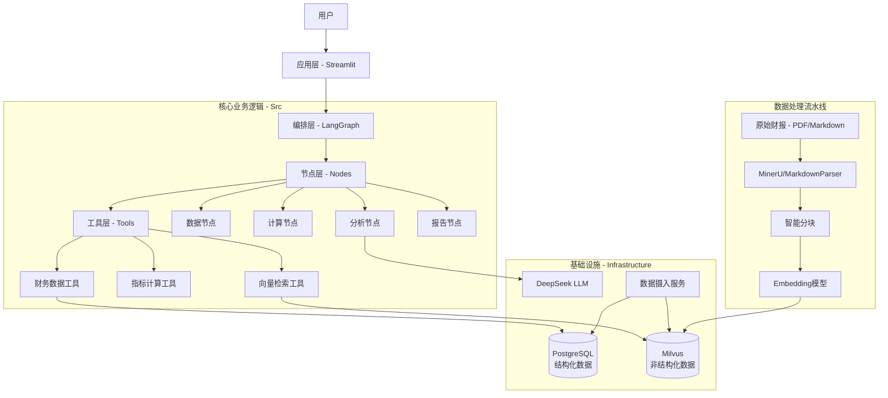
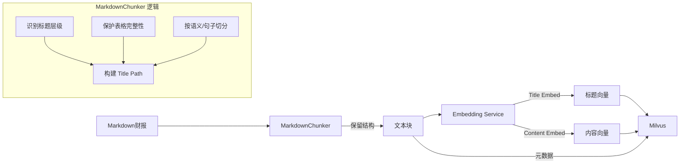

# 财报点评系统 - 技术实现总结

## 1. 技术架构设计

### 1.1 总体架构

本系统采用分层架构设计，实现了数据、业务逻辑、工作流编排和应用层的解耦。

### 1.2 核心技术栈

| 模块                   | 技术选型              | 说明                                                       |
| ---------------------- | --------------------- | ---------------------------------------------------------- |
| **LLM**          | DeepSeek              | 高性价比的大语言模型，擅长逻辑推理和文本生成               |
| **编排框架**     | LangChain + LangGraph | 实现复杂的有向无环图(DAG)工作流，管理状态流转              |
| **向量数据库**   | Milvus                | 高性能向量检索，支持海量文本片段的语义搜索                 |
| **关系数据库**   | PostgreSQL            | 存储结构化的财务报表数据（资产负债表、利润表、现金流量表） |
| **PDF解析**      | MinerU                | 高精度的PDF文档解析工具，能够识别复杂表格和文档结构        |
| **Markdown处理** | 自研 MarkdownChunker  | 针对财报Markdown格式优化的分块器，保留标题层级和表格结构   |
| **前端应用**     | Streamlit             | 快速构建交互式数据应用                                     |

## 2. 开发实现过程

### 2.1 避免 GIGO (Garbage In, Garbage Out) 的核心策略

在财报分析中，数据的准确性至关重要。我们采取了"**代码计算指标，LLM分析洞察**"的策略：

1. **结构化数据提取**：将财报中的三张表提取并存入 PostgreSQL 数据库，保证基础数据的准确性。
2. **确定性指标计算**：使用 Python 代码而非 LLM 进行财务指标（如毛利率、净利率、同比增长率）的计算，杜绝大模型的幻觉问题。
3. **基于事实的生成**：LLM 接收的输入包含精确计算的指标数值和检索到的原文片段，仅负责定性分析和文本润色。

### 2.2 智能分块与数据摄入 (Data Ingestion)

针对财报文档长、结构复杂的特点，我们设计了专门的数据摄入流程：

**关键创新点**：

- **混合分块策略**：自研 `MarkdownChunker`，能够识别 Markdown 语法。
- **表格保护**：在分块过程中识别 `<table>` 标签，确保表格数据不被切分到不同块中，保持上下文完整。
- **双路 Embedding**：同时对"标题路径"和"文本内容"进行向量化，提高基于层级结构的检索准确率。

### 2.3 LangGraph 工作流编排

利用 LangGraph 构建了清晰的分析流水线：

1. **Fetch Data**：根据股票代码和报告期，从数据库获取三张表数据。
2. **Calculate**：调用工具计算核心财务指标。
3. **Retrieve**：根据分析目标，从 Milvus 检索相关的管理层讨论与分析 (MD&A) 片段。
4. **Analyze**：多阶段并行分析（核心指标、辅助指标、特定风险）。
5. **Generate**：汇总各阶段分析结果，生成最终报告。
6. **Quality Check**：对生成报告进行自我反思和质量评分。

## 3. 测试与优化过程

### 3.1 单元测试与集成测试

- **分块器测试**：编写了针对 `MarkdownChunker` 的测试用例，验证长段落切分、表格完整性保护、标题层级提取的正确性。
- **检索测试**：测试 Milvus 的检索召回率，调整 Embedding 模型和检索参数（如 Top-K）。
- **端到端测试**：模拟真实财报分析请求，验证从数据获取到报告生成的完整链路。

### 3.2 性能与效果优化

- **显存优化**：针对本地部署环境，对 Embedding 模型和 LLM 进行量化或显存管理优化。
- **Prompt 工程**：迭代优化各分析节点的 Prompt，引入 Few-Shot Learning 提升分析深度。
- **Milvus 参数调优**：调整索引类型 (HNSW) 和搜索参数 (`ef`, `nprobe`)，在速度和精度间取得平衡。
- **结构化约束**：在 Milvus Schema 中增加了字段长度限制 (4096 字符) 并实现了自动截断逻辑，防止超长文本导致写入失败。

## 4. 技术创新点

1. **结构化与非结构化数据的深度融合**：
   系统通过 Tool 机制将 SQL 数据库中的精确指标与向量数据库中的非结构化文本有机结合，既保证了数据的准确性，又保留了丰富的语义信息。
2. **领域感知的智能分块 (Context-Aware Chunking)**：
   不同于通用的按字符长度切分，本系统的 `MarkdownChunker` 能够感知财报的文档结构（章节、表格、段落），保留了"标题路径"元数据，极大提升了检索的上下文相关性。
3. **双向量检索增强 (Dual-Embedding Retrieval)**：
   引入 `title_embedding` 和 `content_embedding`，支持仅通过层级标题进行检索，也支持通过内容语义检索，解决了"问题只涉及宏观概念但内容由于切分而丢失上下文"的问题。
4. **自反思的 Agent 工作流**：
   引入 Quality Check 节点，让 LLM 对自己生成的报告进行评分和反思，低于阈值则触发重新生成或补充检索，实现了系统层面的自我优化。
