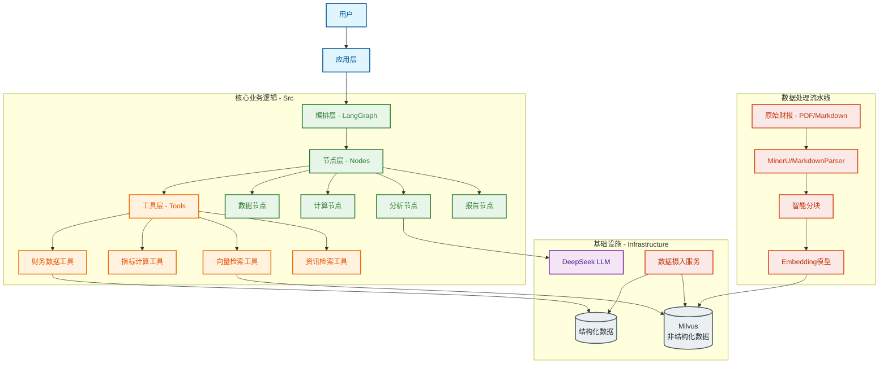
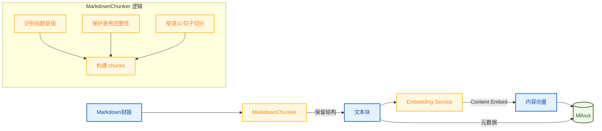

# 财报点评系统 - 技术实现总结

## 1. 技术架构设计

### 1.1 总体架构

本系统采用分层架构设计，实现了数据、业务逻辑、工作流编排和应用层的解耦。

### 1.2 核心技术栈

| 模块                   | 技术选型              | 说明                                                       |
| ---------------------- | --------------------- | ---------------------------------------------------------- |
| **LLM**          | DeepSeek              | 高性价比的大语言模型，擅长逻辑推理和文本生成               |
| **编排框架**     | LangChain + LangGraph | 实现复杂的有向无环图(DAG)工作流，管理状态流转              |
| **向量数据库**   | Milvus                | 高性能向量检索，支持海量文本片段的语义搜索                 |
| **关系数据库**   | PostgreSQL            | 存储结构化的财务报表数据（资产负债表、利润表、现金流量表） |
| **PDF解析**      | MinerU                | 高精度的PDF文档解析工具，能够识别复杂表格和文档结构        |
| **Markdown处理** | 自研 MarkdownChunker  | 针对财报Markdown格式优化的分块器，保留标题层级和表格结构   |
| **前端应用**     | Streamlit             | 快速构建交互式数据应用                                     |

## 2. 开发实现过程

### 2.1 指标计算

在财报分析中，数据的准确性至关重要。我们采取了"**代码计算指标，LLM分析洞察**"的策略：

1. **结构化数据提取**：将财报中的三张表提取并存入 PostgreSQL 数据库，保证基础数据的准确性。
2. **确定性指标计算**：使用 Python 代码而非 LLM 进行财务指标（如毛利率、净利率、同比增长率）的计算，杜绝大模型的幻觉问题。
3. **基于事实的生成**：LLM 接收的输入包含精确计算的指标数值和检索到的原文片段。

**关键创新点**：
- 行业差异化的指标计算工具集
- GIGO到QIQO策略

### 2.2 智能分块与Data Ingestion

针对财报文档长、结构复杂的特点，我们设计了专门的数据摄入流程：

**关键创新点**：

- **混合分块策略**：自研 `MarkdownChunker`，能够识别 Markdown 语法。实现**表格保护**：在分块过程中识别 `<table>` 标签，确保表格数据不被切分到不同块中，保持上下文完整。
- **Context-Aware Chunking**：对"标题路径"和"文本内容"进行向量化，提高基于层级结构的检索准确率。

### 2.3 分面检索

传统的 RAG 方案在处理财报点评时存在明显的效率问题：每个分析维度（如盈利能力、偿债能力、现金流状况等）都需要独立调用一次检索和生成流程，导致：

- **调用次数过多**：一份完整的财报点评可能需要 5-10 次独立的 RAG 调用
- **上下文割裂**：各维度分析缺乏全局视角，难以发现指标间的关联关系
- **成本高昂**：重复的检索和 LLM 调用增加了时间和 Token 成本

为了解决上述问题，我们放弃“泛泛检索+逐个总结”的模式，转而采用**“分面检索+按需组装”的策略。 分面检索即不使用单一的 Query 去检索所有内容，而是根据分析维度（Dimensions），预定义一组**结构化查询（Structured Queries）**。

### 2.4 批量处理与合并请求
核心思想是将多个独立的问题捆绑成一个请求，而不是逐个提问。
批量提问 (Batching Requests): 在向LLM发送请求之前，将所有十多个问题的检索结果整理好。构建一个包含所有问题和各自上下文的单个综合性提示（Prompt），要求LLM一次性生成所有问题的答案。
结构化输出: 在单个综合性提示中，要求LLM以特定的结构（如 JSON、Markdown 表格或带有特定分隔符的文本）返回所有答案，便于后续程序化解析和使用。

### 2.5 资讯数据融合
融合业绩发布会等资讯类数据。

### 2.6 引入缓存 (Caching)
针对可能重复出现的问题或热门查询结果，使用内存数据库（如 Redis）进行缓存。当下一次遇到相同或相似的问题时，直接返回缓存结果，绕过LLM调用。

### 2.7 LangGraph 工作流编排

利用 LangGraph 构建了清晰的分析流水线：

1. **Fetch Data**：根据股票代码和报告期，从数据库获取三张表数据。
2. **Calculate**：调用工具计算核心财务指标。
3. **Retrieve**：根据分析目标，从 Milvus 检索相关的管理层讨论与分析 (MD&A) 片段。
4. **Analyze**：多阶段并行分析（核心指标、辅助指标、特定风险）。
5. **Generate**：汇总各阶段分析结果，生成最终报告。
6. **Quality Check**：对生成报告进行自我反思和质量评分。

## 3. 测试与优化过程

### 3.1 单元测试与集成测试

- **分块器测试**：编写了针对 `MarkdownChunker` 的测试用例，验证长段落切分、表格完整性保护、标题层级提取的正确性。
- **检索测试**：测试 Milvus 的检索召回率，调整 Embedding 模型和检索参数（如 Top-K）。
- **端到端测试**：模拟真实财报分析请求，验证从数据获取到报告生成的完整链路。

### 3.2 性能与效果优化

- **Prompt 工程**：迭代优化各分析节点的 Prompt，引入 Few-Shot Learning 提升分析深度。
- **Milvus 参数调优**：调整索引类型 (HNSW) 和搜索参数 (`ef`, `nprobe`)，在速度和精度间取得平衡。

1. **结构化与非结构化数据的深度融合**：
   系统通过 Tool 机制将 SQL 数据库中的精确指标与向量数据库中的非结构化文本有机结合，既保证了数据的准确性，又保留了丰富的语义信息。
2. **领域感知的智能分块 (Context-Aware Chunking)**：
   不同于通用的按字符长度切分，本系统的 `MarkdownChunker` 能够感知财报的文档结构（章节、表格、段落），保留了"标题"等元数据，极大提升了检索的上下文相关性。支持仅通过层级标题进行检索，也支持通过内容语义检索，解决了"问题只涉及宏观概念但内容由于切分而丢失上下文"的问题。
3. **自反思的 Agent 工作流**：
   引入 Quality Check 节点，让 LLM 对自己生成的报告进行评分和反思，低于阈值则触发重新生成或补充检索，实现了系统层面的自我优化。
