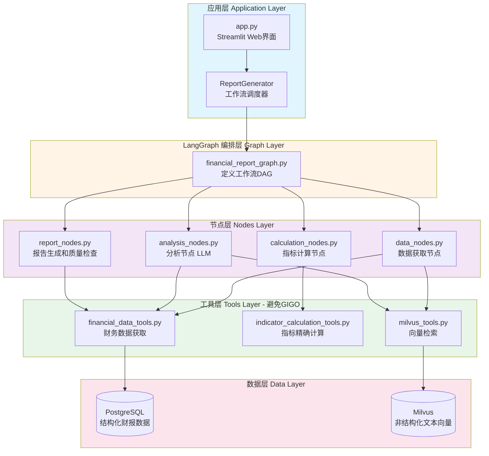

# 关于大模型应用中的 GIGO 陷阱的思考

近期在尝试做一个财报点评agent时，最初采用了最"直觉"的方案：

```
PDF财报 → 解析文本 → 存入Milvus → 向量检索 → LLM生成点评
```

这个方案看起来很"AI Native"：让 LLM 直接处理原始财报文本，依靠其强大的理解能力生成分析报告。但是**结果却令人失望**：

- 🔢 **数据提取混乱**
- 📊 **指标计算错误**
- 📉 **分析质量低下**
- ❌ **可靠性无法保证**

---

## 1. 为什么直接使用 LLM 会失败？

### 1.1 场景分析：财报点评的特殊性

财报分析不同于一般的文本理解任务，它具有以下特点：

| 特性                 | 要求             | LLM 的能力     | 匹配度        |
| -------------------- | ---------------- | -------------- | ------------- |
| **数值精确性** | 数据准确，精度高 | 概率性文本生成 | ❌ 不匹配     |
| **逻辑一致性** | 严格的计算公式   | 上下文理解     | ❌ 不匹配     |
| **结构化提取** | 结构化数据，准确 | 文本模式识别   | ⚠️ 部分匹配 |
| **语义分析**   | 理解业务含义     | 强项           | ✅ 匹配       |
| **洞察生成**   | 发现趋势和异常   | 强项           | ✅ 匹配       |

**核心矛盾**：财报分析需要"精确计算"和"语义理解"的结合，而我却把所有任务都交给了 LLM.

### 1.2 三类典型的 GIGO 陷阱

#### 陷阱一：LLM 提取数据

**场景还原**：

从 100 页的 PDF 财报中提取关键数据：

```
Prompt:
"请从财报中提取以下指标：营业收入、净利润、研发费用、销售费用"

LLM 可能提取到：
- 营业收入：30.5亿 ✅
- 净利润：5.2亿 ❌（实际是"归母净利润"，而非"净利润"）
- 研发费用：2.5亿 ✅
- 销售费用：1.8亿 ❌（单位是"万元"，但 LLM 理解成"亿元"）
```

**问题剖析**：

- PDF 中同一指标可能出现多次（合并报表、母公司报表、历史数据）
- 财务术语细微差异（净利润 vs 归母净利润 vs 扣非净利润）
- 单位不统一（元、万元、亿元混用）

LLM 擅长"理解大意"，但在**精确数据提取**上容易出错。

#### 陷阱二：让 LLM 做数学题

**场景还原**：

```
用户输入：
"三六零2024Q1营业收入30.5亿，去年同期26.8亿，请计算同比增速并分析。"

LLM 输出：
"同比增速约为 14%，公司保持稳健增长..."
```

**问题剖析**：

- 正确答案：`(30.5 - 26.8) / 26.8 = 13.8%`
- LLM 回答：`14%`（误差 0.2%）
- 看似微小，但在专业报告中**不可接受**

**为什么会错？**

LLM 的本质是**基于模式的文本生成器**，而非计算引擎。它"学会"了增长率的概念，但没有真正的数学能力。就像一个背诵了九九表的学生，换个角度考察就会露馅。

#### 陷阱三：让 LLM 做业务判断

**场景还原**：

```
Prompt:
"根据财报，判断该公司是否属于高研发投入型企业。
研发费用：2.5亿，营业收入：30.5亿。"

LLM 输出：
"研发费用率为 8.2%，属于较高水平，可认定为高研发投入企业。"
```

**问题剖析**：

这个判断**在行业语境下是错误的**：

- **计算机/软件行业**：研发费用率 15-20% 才算高水平
- **传统制造业**：5% 就已经是高投入了
- **医药行业**：可能高达 20-30%

LLM 给出了一个"听起来合理"的答案，但缺乏**行业特定的业务知识**。

---

## 2. 破解方法

### 2.1 核心思想：让专业的组件做专业的事

我们需要重新审视任务分解：

| 任务类型       | 是否需要 LLM | 正确的方案               |
| -------------- | ------------ | ------------------------ |
| 精确数值计算   | ❌           | Python/JavaScript 代码   |
| 业务规则判断   | ❌           | 配置文件 + 条件逻辑      |
| 结构化数据提取 | ❌           | 专业解析器（SQL、Excel） |
| 语义理解分析   | ✅           | LLM                      |
| 自然语言生成   | ✅           | LLM                      |
| 模式识别洞察   | ✅           | LLM                      |

**设计原则**：

> **Garbage Prevention > Garbage Correction**
> 在数据进入 LLM 之前，就确保其已经是"高质量输入"

### 2.2 新架构：分层设计

我们采用了**五层架构**，每层有明确的职责边界：



**第一层：数据层（Data Layer）**

- **PostgreSQL**：存储结构化财报数据（利润表、资产负债表、现金流量表）
- **Milvus**：存储非结构化文本向量（财报说明、业务讨论等）

**设计要点**：

- 数据源分离：结构化用关系数据库，非结构化用向量库
- 避免让 LLM 从 PDF 中提取数据（GIGO 陷阱）

**第二层：工具层（Tools Layer）** - **GIGO 防线**

这是防止 GIGO 的**第一道防线**：

```python
# ❌ 错误做法：让 LLM 计算
prompt = "营收30.5亿，去年26.8亿，计算增速"

# ✅ 正确做法：使用 Tool 精确计算
@tool
def calculate_growth_rate(current: float, previous: float) -> dict:
    """精确计算同比增速"""
    if previous == 0:
        return {"growth_rate": None, "display": "N/A"}
  
    growth = ((current - previous) / abs(previous)) * 100
    return {
        "growth_rate": round(growth, 2),
        "display": f"{growth:+.2f}%",
        "current": current,
        "previous": previous
    }

# 结果：{"growth_rate": 13.8, "display": "+13.8%"}
```

**关键设计**：

- 所有数值计算由代码完成（100% 准确）
- 工具输出包含元数据（便于追溯）
- 返回结构化数据（便于后续节点使用）

**第三层：节点层（Nodes Layer）**

节点是**业务逻辑的载体**，协调 Tools 和 LLM：

```python
def calculation_node(state: FinancialReportState):
    """指标计算节点"""
  
    # 1. 从状态中获取财务数据
    financial_data = state["financial_data"]
  
    # 2. 调用 Tools 进行计算
    revenue_growth = calculate_growth_rate(
        financial_data["revenue_current"],
        financial_data["revenue_previous"]
    )
  
    # 3. 更新状态
    state["indicators"]["revenue_growth"] = revenue_growth
  
    return state
```

**设计要点**：

- 节点不包含计算逻辑（委托给 Tools）
- 节点负责数据流转和状态更新
- 每个节点只做一件事（单一职责）

**第四层：编排层（Graph Layer）**

使用 **LangGraph** 定义工作流：


**关键特性**：

1. **明确的数据流**：

   ```
   原始数据 → 计算结果 → 检索上下文 → LLM 分析 → 报告生成 → 质量检查
   ```
2. **条件路由**：

   - 质量检查不通过 → 重新生成报告
   - 数据缺失 → 记录日志并继续（降级处理）
3. **状态管理**：

   ```python
   class FinancialReportState(TypedDict):
       # 输入信息
       company_name: str
       report_period: str

       # 中间结果
       financial_data: dict
       indicators: dict
       context: list

       # LLM 分析结果
       core_analysis: str
       auxiliary_analysis: str
       specific_analysis: str

       # 最终输出
       report: str
       quality_score: int
   ```

**第五层：应用层（Application Layer）**

提供用户界面：

- **Streamlit Web UI**：适合非技术用户
- **Python API**：适合程序化调用
- **命令行工具**：适合批量处理

---

### 2.3 核心设计模式：职责分离

#### 模式 1：计算与分析分离

**❌ 反模式**：让 LLM 既计算又分析

```python
prompt = f"""
分析三六零财报：
- 营业收入：{revenue_current}亿（去年{revenue_previous}亿）
- 净利润：{profit_current}亿（去年{profit_previous}亿）

请计算同比增速并分析经营状况。
"""
```

**问题**：

- LLM 计算可能出错
- 错误的计算会导致错误的分析

**✅ 正确模式**：计算与分析分离

```python
# 步骤 1：代码计算（100% 准确）
revenue_growth = calculate_growth_rate(revenue_current, revenue_previous)
profit_growth = calculate_growth_rate(profit_current, profit_previous)

# 步骤 2：LLM 分析（基于准确数据）
prompt = f"""
分析三六零财报（2024Q1）：

核心指标：
- 营业收入：{revenue_current:.2f}亿，同比增长 {revenue_growth['display']}
- 净利润：{profit_current:.2f}亿，同比增长 {profit_growth['display']}

请分析公司经营状况和盈利能力变化。
"""
```

#### 模式 2：规则外部化

**场景**：不同行业的分析重点不同

**❌ 反模式**：在 Prompt 中硬编码规则

```python
prompt = f"""
分析计算机行业公司财报，重点关注：
1. 研发费用率（通常 > 15% 为正常）
2. 云服务收入占比
3. 合同负债变化（订阅制先导信号）
...
"""
```

**问题**：

- 规则难以维护（分散在多个 Prompt 中）
- 扩展新行业需要修改代码
- LLM 可能"理解偏差"

**✅ 正确模式**：配置文件管理规则

```yaml
# industry_configs/computer.yaml
name: "计算机行业"
core_indicators:
  - id: revenue_growth
    name: 营业收入增速
    threshold: 20%  # 高增长标准
  
  - id: profit_growth
    name: 净利润增速
    threshold: 25%

auxiliary_indicators:
  - id: rd_expense_ratio
    name: 研发费用率
    threshold: 15%  # 行业正常水平
    importance: high  # 重要性标记
  
  - id: gross_margin
    name: 毛利率
    threshold: 60%

specific_indicators:
  - id: contract_liability
    name: 合同负债
    rule: |
      对于订阅制/SaaS公司，合同负债是业绩先导指标。
      增长 > 30% 为强信号，10-30% 为正常，< 10% 需关注。
    applies_to: ["SaaS", "订阅制"]
```

**使用方式**：

```python
# 加载行业配置
industry_config = load_config("computer")

# 代码判断（明确、可靠）
rd_ratio = calculate_rd_expense_ratio(rd_expense, revenue)

if rd_ratio > industry_config.rd_threshold:
    rd_level = "正常水平"
else:
    rd_level = "低于行业平均"

# LLM 接收明确的结论
prompt = f"""
研发费用率：{rd_ratio:.1f}%（{rd_level}，行业基准 {industry_config.rd_threshold}%）

请分析公司研发投入的合理性。
"""
```

**优势**：

- ✅ 规则集中管理，便于维护
- ✅ 扩展新行业只需添加配置文件
- ✅ 规则执行 100% 可靠（代码判断）
- ✅ 配置即文档，清晰可读

#### 原则 3：可观测与可追溯

**每个关键节点记录**：

- 输入数据快照
- 处理时间
- 输出结果
- 错误信息

**示例**：

```python
logger.info(f"[数据获取] 成功获取 {company_name} {report_period} 财报数据")
logger.info(f"[指标计算] 计算 {len(indicators)} 个指标，耗时 {elapsed:.2f}s")
logger.warning(f"[质量检查] 报告质量评分 {score}，低于阈值 80")
logger.error(f"[LLM 调用] 失败，错误：{error}")
```

## 3. 从 GIGO 到 QIQO

- Garbage In, Garbage Out（避免垃圾输入）
- Quality In, Quality Out（主动构建高质量输入）

### **具体实践**

1. **数据治理**：从源头保证数据质量

   - 数据清洗、去重、标准化
   - 数据血缘追踪
   - 数据质量监控
2. **工具化**：将通用能力封装为工具

   - 指标计算工具库
   - 数据验证工具集
   - 质量检查工具链
3. **配置化**：将业务知识沉淀为配置

   - 行业规则库
   - Prompt 模板库
   - 阈值参数库
4. **可解释**：确保每个决策可追溯

   - 完整的日志记录
   - 中间结果保存
   - 决策路径可视化

### 检查清单

**在构建 LLM 应用前，检查**：

- [ ] 哪些任务需要精确计算？（→ 使用代码）
- [ ] 哪些任务需要业务判断？（→ 使用规则配置）
- [ ] 哪些任务需要语义理解？（→ 使用 LLM）
- [ ] 数据从何而来？是否可靠？
- [ ] LLM 输出如何验证？
- [ ] 如果 LLM 出错，系统能否发现？
- [ ] 架构是否支持扩展新场景？
- [ ] 能否清晰地追溯每个决策？

**高风险信号**：

- ❌ 让 LLM 做数值计算
- ❌ 让 LLM 提取关键数据
- ❌ 直接使用 LLM 输出做决策
- ❌ Prompt 分散在多个文件
- ❌ 无法验证 LLM 输出
- ❌ 缺乏日志和监控

**安全信号**：

- ✅ 计算由代码完成
- ✅ 规则由配置管理
- ✅ LLM 只做语义分析
- ✅ 完整的质量检查
- ✅ 分层架构清晰
- ✅ 可观测、可追溯

## 结语

1. **LLM 不是万能的**计算、规则、提取任务应交给专业组件
2. **架构比 Prompt 重要**不要期望通过"更好的 Prompt"解决架构问题
3. **工程化是关键**Prompt Engineering 只是第一步，系统工程化才是长久之计
4. **GIGO 原则不仅没有过时，反而变得更加重要**。
5. **质量是设计出来的 :** 在数据流入 LLM 之前，就确保其是高质量输入，从GIGO到QIQO是破局之道。

## 参考

- fin-report-reviewer: https://github.com/damaohongtu/fin-report-reviewer
